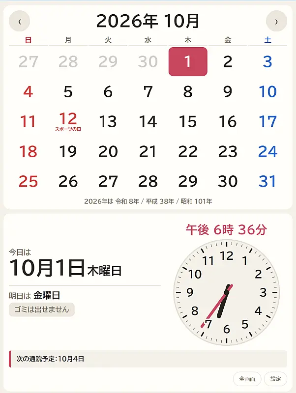
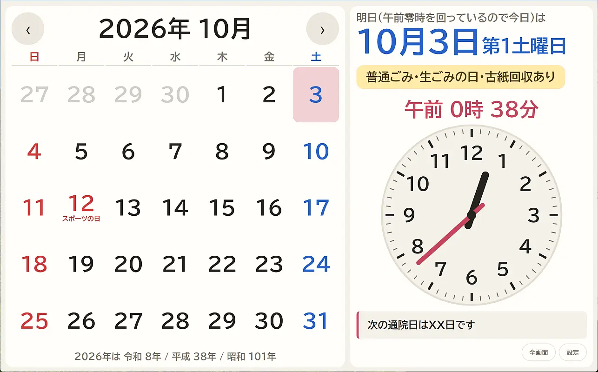
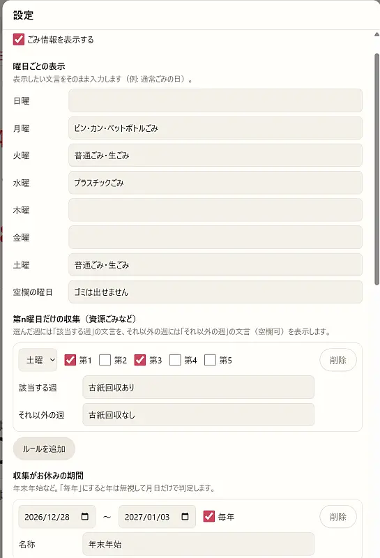
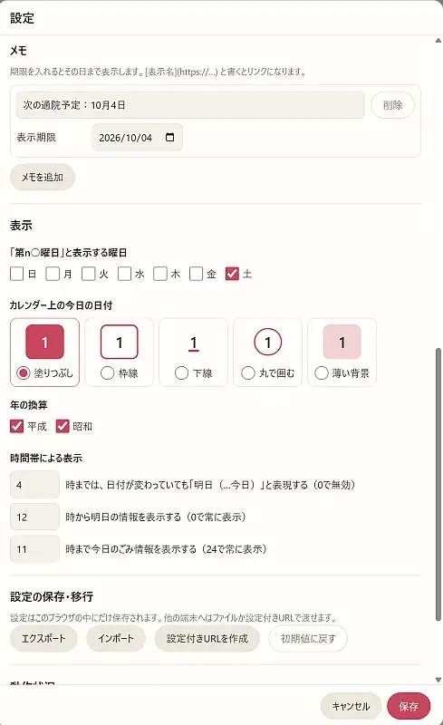

# GarbageCal2

曜日がわからなくなりがちな高齢者向けの、ごみ収集日＆メモ表示機能付きカレンダーアプリです。

電源を繋いだ8～10インチ程度のAndroidタブレットを、ディスプレイの自動消灯機能をオフにしてブラウザを常時表示させておく想定です。

|カレンダー表示(縦)|(横)|
|---|---|
|||

|設定画面1|設定画面2|
|---|---|
|||


## 設置

中身を **HTTPS** で配信できる場所にそのまま置きます（オフライン動作に使う Service Worker が HTTPS 必須のため）。

手元で試すとき:

```
python -m http.server 8765
```

→ http://127.0.0.1:8765/

Github Page（このサイト）に設置したものをそのまま使うとき：

https://id-fa.github.io/GarbageCal2/

## 設定

画面右下の「設定」から編集します。設定はそのブラウザの localStorage にだけ保存されます。

- **エクスポート / インポート** … JSON ファイルで保存・読み込み
- **設定付きURL** … 設定を埋め込んだ URL を作成。タブレットのブラウザのホームに設定すれば、その設定で表示されます。
  開いたときに取り込むかどうかの確認が出ます。同じ URL の設定が適用されるのは最初の1回だけなので、タブレット側で後から設定を変えても、開き直したときに巻き戻りません。
  URL に載せられる設定の大きさには上限があります（メモが多いと超えます）。超える場合はエクスポート / インポートを使ってください。
- **写真** … 端末内の写真を選ぶと、カレンダーを小さくして下の隅（左下か右下）に寄せ、空いたところに写真を表示します。
  写真は縮小したうえでそのブラウザの中（IndexedDB）に保存されます。エクスポートや設定付きURLには含まれないので、端末ごとに選んでください。


## 仕組み

- **時刻** … 端末の時計は信用せず、サーバーの `Date` ヘッダーとの差で補正します（起動時・復帰時・1時間ごと）。日付の計算は端末のタイムゾーン設定によらず日本時間固定です。
- **祝日** … [Holidays JP API](https://holidays-jp.github.io/) から週1回取得して localStorage に保存します。取得できない間は同梱の `syukujitsu.csv`（〜2027年）、それ以降の年は祝日法に基づく計算で表示します。
  `syukujitsu.csv` は[内閣府の CSV](https://www8.cao.go.jp/chosei/shukujitsu/gaiyou.html) と同じ形式で、公式ファイル（Shift_JIS）にそのまま置き換えられます。
- **オフライン** … 一度開けば Service Worker がファイル一式をキャッシュし、オフラインでも起動します。オンラインのときは常にサーバーの最新ファイルを使います。

## ファイルを追加・削除したとき

`app/sw.js` の `ASSETS`（オフライン用にキャッシュするファイル一覧）を合わせて更新し、`CACHE` の番号を上げてください。

